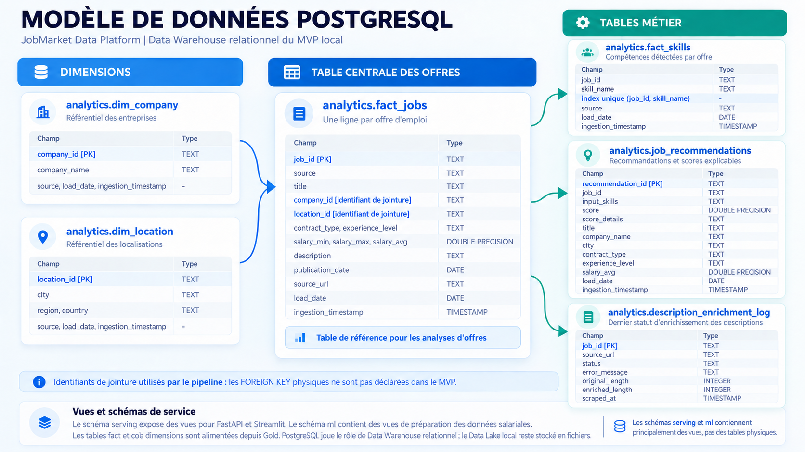
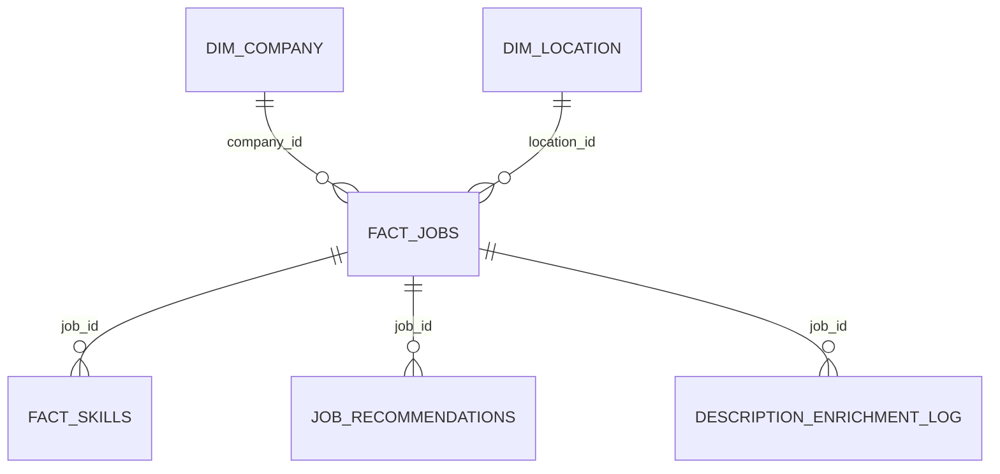

# 07 - Rapport final consolide

## Introduction

**JobMarket Data Platform** est une plateforme Data Engineering specialisee dans l'analyse des offres d'emploi data en France. Elle collecte des offres reelles, historise les donnees, applique des transformations PySpark, charge un Data Warehouse PostgreSQL, puis expose les resultats via FastAPI, Streamlit, Prometheus et Grafana.

Ce rapport consolide les livrables precedents et presente la version finalisee du projet : architecture, deploiement, automatisation, monitoring, securite, bilan et perspectives.

## Objectif metier

Le projet repond a une question simple : comment mieux comprendre le marche des metiers data en France a partir d'offres d'emploi reelles ?

Les besoins couverts sont les suivants :

- identifier les competences techniques les plus demandees ;
- visualiser les villes et entreprises qui recrutent ;
- analyser les salaires disponibles ;
- rechercher des offres selon des criteres utilisateur ;
- recommander des offres adaptees a un profil ;
- fournir une base technique reproductible pour une industrialisation cloud.

## Perimetre final

Le perimetre retenu se concentre sur les offres data en France.

Sources integrees :

- **Adzuna API** : source principale du dataset final ;
- **The Muse API** : connecteur multi-source disponible et filtre sur le perimetre France/data ;
- **Web scraping optionnel** : module present pour integrer une source HTML, plus une etape specifique d'enrichissement des descriptions Adzuna depuis les URLs stockees en base.

Fonctionnalites livrees :

- pipeline Bronze, Silver, Gold ;
- transformations PySpark ;
- Data Warehouse PostgreSQL ;
- API REST FastAPI ;
- dashboard Streamlit ;
- moteur de recherche interactif ;
- recommandations explicables ;
- vues salaire optionnelles pour une evolution analytique ;
- alertes mail avec mode preview et configuration SMTP optionnelle ;
- monitoring Prometheus et Grafana ;
- tests automatises.

## Architecture technique globale

### Vue globale du pipeline


Dans le MVP, le Data Lake est stocke localement sous `data/local/`, en couches Bronze, Silver et Gold. Azure est uniquement une cible d'evolution.

```text
Adzuna API + The Muse API + web scraping optionnel
        |
        v
Apache Airflow / script local
        |
        v
Bronze JSON historise
        |
        v
Silver Parquet nettoye avec PySpark
        |
        v
Gold Parquet analytique avec PySpark
        |
        v
PostgreSQL Data Warehouse
  - analytics
  - serving
  - ml
        |
        +--> FastAPI
        |      +--> /jobs, /statistics, /jobs/search, /recommendations
        |      +--> /ml/salary/*
        |      +--> /monitoring/warehouse
        |      +--> /metrics
        |
        +--> Streamlit
        |      +--> analyse metier, recherche, salaire, alertes
        |
        +--> Prometheus
               +--> Grafana
```

## Modele de donnees PostgreSQL

Le Data Warehouse PostgreSQL repose sur un modele relationnel simple et explicable. La table centrale est `analytics.fact_jobs`. Elle contient les offres finales, puis se relie aux dimensions entreprise et localisation. Les competences, recommandations et traces d'enrichissement sont rattachees aux offres par `job_id`.



Les liens du schema representent les identifiants utilises dans les jointures. Dans le MVP, les contraintes `FOREIGN KEY` physiques ne sont pas declarees.



Le modele s'apparente a un schema en etoile : `fact_jobs` constitue la table centrale, `dim_company` et `dim_location` apportent les dimensions entreprise et localisation, tandis que `fact_skills`, `job_recommendations` et `description_enrichment_log` sont rattachees aux offres par `job_id`. Les vues `serving` exposent les donnees a l'API et au dashboard, et les vues `ml` preparent les donnees pour l'analyse des salaires.

L'architecture cible cloud est concue pour Azure :

- Azure Data Lake Storage Gen2 pour Bronze, Silver et Gold ;
- Azure Databricks ou Synapse Spark pour executer PySpark ;
- Azure Database for PostgreSQL pour le Data Warehouse ;
- Azure Container Apps ou App Service pour FastAPI et Streamlit ;
- Azure Key Vault pour les secrets ;
- Azure Monitor ou Prometheus/Grafana pour la supervision.

## Resultats obtenus

Etat verifie via l'API locale et l'endpoint Prometheus `/metrics` apres le chargement high volume :

| Indicateur | Valeur |
| --- | ---: |
| Offres chargees | 2 028 |
| Entreprises distinctes | 793 |
| Localisations | 266 |
| Lignes de competences | 773 |
| Recommandations | 10 |
| Lignes vues salaire | 2 028 |
| Lignes salaire exploitables | 380 |
| Lignes sans salaire exploitable | 1 648 |
| Descriptions Adzuna enrichies | 49 |
| Qualite data | PASS |
| Sources sample | 0 |
| URLs example.com | 0 |
| Localisations hors France | 0 |

La partie IA n'est pas obligatoire dans ce projet. Les vues salaire et les recommandations sont conservees comme extensions analytiques explicables, tandis que le coeur du livrable reste la chaine Data Engineering.

Principales competences observees :

- Power BI ;
- Databricks ;
- SQL ;
- Azure ;
- Python ;
- GCP ;
- Snowflake ;
- AWS ;
- DBT ;
- Spark.

Principales villes observees :

- Paris ;
- Lyon ;
- Levallois-Perret ;
- Nantes ;
- Toulouse ;
- La Defense ;
- Massy ;
- Saint-Cloud ;
- Puteaux ;
- Neuilly-sur-Seine.

## Conclusions tirees

Le projet montre que les offres d'emploi data en France peuvent etre structurees en un patrimoine de donnees exploitable. Les donnees brutes des APIs sont utiles mais insuffisantes seules : elles doivent etre nettoyees, dedoublonnees, normalisees et enrichies avant d'etre valorisees.

Les principales conclusions sont :

- le marche data francais est fortement concentre sur Paris et les grandes villes ;
- les competences BI, cloud et data engineering ressortent fortement ;
- les salaires sont disponibles sur une minorite d'offres, ce qui justifie des vues ML separees avec controle de qualite ;
- la limite de description Adzuna penalise l'extraction de competences, d'ou l'ajout d'un backfill HTML ;
- une architecture simple mais bien separee rend le projet plus facile a expliquer, tester et faire evoluer ;
- le monitoring permet de verifier rapidement que l'API, PostgreSQL, la qualite et la volumetrie sont coherents avant une demonstration.

## Gestion du code et bonnes pratiques

Le depot est structure de maniere professionnelle :

```text
api/                   Application FastAPI
dashboard/             Application Streamlit
dags/                  DAG Airflow
src/jobmarket/         Code metier du pipeline
configs/               Plans de collecte et profils utilisateur
docs/                  Documentation technique et livrables projet
monitoring/            Prometheus et Grafana
scripts/               Scripts de lancement et maintenance
tests/                 Tests automatises
data/local/            Donnees locales ignorees par Git
pyproject.toml         Packaging, dependances et configuration des tests
```

Bonnes pratiques appliquees :

- separation ingestion, transformation, chargement, API, dashboard ;
- logique metier hors du DAG Airflow ;
- fichiers de configuration separes du code ;
- dependances Python centralisees dans `pyproject.toml` ;
- donnees locales ignorees par Git ;
- tests automatises sur API, recherche, vues salaire, monitoring, chargement PostgreSQL et alertes mail ;
- code rejouable depuis le README et les scripts ;
- absence de donnees sample dans la base finale ;
- dashboard sans affichage des identifiants techniques inutiles pour l'utilisateur ;
- branche Git dediee au travail, puis fusion vers `main` lorsque le rendu est pret ;
- scan anti-secret avant publication.

Lien du depot Git a fournir dans le rendu :

```text
<A REMPLACER PAR LE LIEN GITHUB OU GITLAB DU PROJET>
```

## Gestion des secrets

Les secrets ne sont pas stockes dans le code source.

Mesures appliquees :

- le fichier `.env` contient les valeurs locales sensibles ;
- `.env` est ignore par Git via `.gitignore` ;
- `.env.example` documente uniquement les variables attendues avec des valeurs fictives ;
- les identifiants API, mots de passe PostgreSQL, mots de passe Grafana et parametres SMTP sont fournis par variables d'environnement ;
- les logs du pipeline masquent les valeurs sensibles avant ecriture ;
- le script `scripts/check_no_secrets.py` compare les vrais secrets locaux de `.env` avec les fichiers du projet sans afficher leurs valeurs ;
- en cible Azure, les secrets doivent etre deplaces dans Azure Key Vault.

Secrets concernes :

- identifiants Adzuna ;
- mot de passe PostgreSQL ;
- compte administrateur Grafana ;
- identifiants SMTP ;
- cles Azure si le deploiement cloud est active.

Cette organisation maintient les secrets hors du code, des interfaces et des logs. En local, l'application les lit depuis `.env`, ignore par Git ; le depot ne contient que `.env.example` avec des valeurs fictives. Le script anti-secret verifie avant publication qu'aucune valeur locale n'apparait dans les fichiers du projet. Dans une future production Azure, les secrets seraient geres dans Azure Key Vault.

## Deploiement

Le projet peut etre lance de deux manieres.

Mode local rapide :

```powershell
cd "<dossier_du_projet>"
.\.venv\Scripts\Activate.ps1
python scripts/run_local_pipeline.py --step all
python -m uvicorn api.main:app --host 127.0.0.1 --port 8000
python -m streamlit run dashboard\app.py --server.address 127.0.0.1 --server.port 8501
```

Mode Docker Compose :

```powershell
docker compose up -d --build
```

Services conteneurises :

- PostgreSQL ;
- FastAPI ;
- Streamlit ;
- Airflow ;
- Prometheus ;
- Grafana.

Le projet ne depend pas d'un modele IA obligatoire. Les vues salaire et recommandations sont exposees par l'API et le dashboard, mais elles restent des extensions analytiques explicables, pas un service de modele separe a conteneuriser.

Bonnes pratiques DevOps appliquees :

- environnement reproductible avec Docker Compose ;
- dependances centralisees dans `pyproject.toml` ;
- configuration par variables d'environnement ;
- fichiers sensibles ignores par Git ;
- tests automatises avant livraison ;
- endpoints de sante et de monitoring ;
- separation entre compose applicatif complet et compose monitoring local ;
- documentation de reprise dans le README et les livrables.

Un fichier dedie permet aussi de lancer uniquement le monitoring local :

```powershell
docker compose -f docker-compose.monitoring.yml up -d prometheus grafana
```

URLs de demonstration :

- API Swagger : `http://127.0.0.1:8000/docs` ;
- Streamlit : `http://127.0.0.1:8501` ;
- Prometheus : `http://localhost:9090` ;
- Grafana : `http://localhost:3000`.

## Automatisation et monitoring

Automatisation mise en place :

- Airflow orchestre le pipeline complet via le DAG `jobmarket_pipeline` ;
- la frequence Airflow est configurable avec `JOBMARKET_AIRFLOW_SCHEDULE`, en quotidien par defaut (`@daily`) ou en hebdomadaire (`0 6 * * 1`) ;
- un script local permet de rejouer chaque etape rapidement ;
- les traitements sont decoupes en taches : extraction, Bronze, Silver, Gold, skills, recommandations, qualite, chargement PostgreSQL, enrichissement Adzuna ;
- les tests automatises valident les composants critiques.

Monitoring mis en place :

- FastAPI expose `/monitoring/warehouse` pour suivre l'etat metier ;
- FastAPI expose `/metrics` au format Prometheus ;
- Prometheus collecte les metriques de disponibilite, volumetrie, qualite et vues salaire ;
- Grafana affiche les tableaux de bord de monitoring ;
- Streamlit affiche aussi une page Monitoring lisible pour la demo.

Metriques surveillees :

- disponibilite API ;
- disponibilite PostgreSQL ;
- statut qualite ;
- nombre d'offres, entreprises, localisations, competences et recommandations ;
- nombre de lignes des vues salaire ;
- sources sample ;
- URLs `example.com` ;
- localisations hors France ;
- statut de l'enrichissement des descriptions Adzuna.

Requetes Prometheus principales :

| Requete | Role |
| --- | --- |
| `jobmarket_api_up` | Disponibilite FastAPI |
| `jobmarket_postgres_up` | Disponibilite PostgreSQL |
| `jobmarket_jobs_total` | Volumetrie des offres |
| `jobmarket_companies_total` | Volumetrie des entreprises |
| `jobmarket_skills_total` | Volumetrie des competences detectees |
| `jobmarket_quality_status` | Statut global qualite |
| `jobmarket_quality_blocking_issues_total` | Nombre d'anomalies bloquantes |

Gestion des erreurs et alertes :

- les controles qualite bloquent les anomalies critiques ;
- les erreurs de scraping sont tracees dans `analytics.description_enrichment_log` ;
- l'API retourne des reponses lisibles si PostgreSQL est indisponible ;
- la page Alertes mail permet de previsualiser les offres detectees ;
- l'envoi reel par mail est active seulement si la configuration SMTP est renseignee ;
- Prometheus et Grafana permettent d'identifier une baisse de disponibilite ou une incoherence de volumetrie.

## Bilan

Principales difficultes rencontrees :

- limiter le bruit des sources pour rester sur le marche data en France ;
- contourner les descriptions tronquees de l'API Adzuna ;
- normaliser les villes pour eviter des libelles trop fins comme des arrondissements ;
- configurer Spark sous Windows avec Hadoop local ;
- garder une demo robuste malgre les contraintes de temps ;
- rendre le dashboard plus lisible et plus attractif.

Verrous techniques majeurs :

- enrichissement HTML depuis les URLs Adzuna stockees en base ;
- pipeline PySpark compatible local Windows ;
- synchronisation entre Gold Parquet, PostgreSQL, API et Streamlit ;
- monitoring Prometheus/Grafana connecte a une API locale ;
- gestion propre des cas sans SMTP configure.

Contribution principale :

La contribution principale est la construction d'une chaine Data Engineering complete, explicable et demonstrable : collecte reelle, transformation PySpark, warehouse PostgreSQL, API, dashboard, recherche, recommandations, vues salaire optionnelles, monitoring et documentation de reprise.

Pistes d'amelioration :

- automatiser une CI/CD complete avec GitHub Actions, GitLab CI ou Jenkins ;
- ajouter Terraform pour decrire l'infrastructure Azure ;
- charger un historique quotidien pour analyser les tendances dans le temps ;
- passer d'un full refresh logique a un mode delta base sur les nouvelles offres et des watermarks ;
- industrialiser l'enrichissement HTML avec file d'attente, retry et limitation de debit ;
- entrainer un modele de prediction salariale plus avance ;
- ajouter une authentification a l'API et au dashboard ;
- ajouter des alertes Prometheus vers mail ou Teams ;
- versionner les schemas de donnees.

## Suite du projet

Pour passer en production, le pipeline pourrait etre scale ainsi :

- stockage Bronze/Silver/Gold dans Azure Data Lake Storage Gen2 ;
- execution Spark sur Databricks avec jobs planifies ;
- Data Warehouse sur Azure Database for PostgreSQL ;
- API et dashboard deployes en containers ;
- secrets dans Azure Key Vault ;
- logs et alertes dans Azure Monitor, Prometheus ou Grafana ;
- orchestration Airflow ou Azure Data Factory ;
- CI/CD pour tester, construire et deployer automatiquement.

Axes d'amelioration fonctionnels :

- integrer d'autres sources specialisees data ;
- ajouter une collecte incrementalisee par date de publication ;
- produire des tendances par semaine ou par mois ;
- ameliorer les recommandations avec ponderation par seniorite et salaire ;
- ajouter des alertes mail planifiees ;
- visualiser les donnees en quasi temps reel ;
- fournir un export CSV des recherches.

Contribution a la connaissance de la donnee :

Le projet transforme des offres dispersees en indicateurs exploitables. Il aide un candidat a identifier les competences a travailler, un organisme de formation a adapter son contenu, et un recruteur a comprendre la dynamique du marche data en France.

## Bibliographie

Sources techniques et documentations utilisees :

- Documentation Adzuna API : `https://developer.adzuna.com/`
- Documentation The Muse API : `https://www.themuse.com/developers/api/v2`
- Documentation Apache Spark / PySpark : `https://spark.apache.org/docs/latest/api/python/`
- Documentation Apache Airflow : `https://airflow.apache.org/docs/`
- Documentation PostgreSQL : `https://www.postgresql.org/docs/`
- Documentation FastAPI : `https://fastapi.tiangolo.com/`
- Documentation Streamlit : `https://docs.streamlit.io/`
- Documentation Docker Compose : `https://docs.docker.com/compose/`
- Documentation Prometheus : `https://prometheus.io/docs/`
- Documentation Grafana : `https://grafana.com/docs/`
- Documentation Azure Data Lake Storage Gen2 : `https://learn.microsoft.com/azure/storage/blobs/data-lake-storage-introduction`
- Documentation Azure Key Vault : `https://learn.microsoft.com/azure/key-vault/`

Ces sources ont servi a cadrer les choix d'architecture, les connecteurs, les transformations, le deploiement local et la trajectoire cloud.

## Annexes

### Annexe A - Endpoints consommes

| Source | Usage |
| --- | --- |
| Adzuna API | Collecte principale des offres France/data |
| The Muse API | Connecteur multi-source et extension de collecte |
| Pages HTML Adzuna | Enrichissement optionnel des descriptions tronquees |

### Annexe B - Endpoints developpes

| Endpoint | Role |
| --- | --- |
| `GET /health` | Etat de l'API |
| `GET /jobs` | Liste des offres |
| `GET /jobs/search` | Recherche multicritere |
| `GET /search/options` | Options de filtres |
| `GET /sources` | Volumetrie par source |
| `GET /companies` | Entreprises recruteuses |
| `GET /skills` | Competences detectees |
| `GET /recommendations` | Recommandations explicables |
| `GET /statistics` | KPI globaux |
| `GET /ml/salary/features` | Features salaire optionnelles |
| `GET /ml/salary/training` | Dataset d'entrainement salaire |
| `GET /ml/salary/metadata` | Statistiques salaire |
| `GET /monitoring/warehouse` | Etat warehouse et qualite |
| `GET /metrics` | Metriques Prometheus |
| `POST /alerts/email/preview` | Previsualisation d'une alerte mail |
| `POST /alerts/email/send` | Envoi d'une alerte mail si SMTP configure |

### Annexe C - Structure des fichiers de configuration

| Fichier | Role |
| --- | --- |
| `.env.example` | Modele des variables d'environnement |
| `.env` | Configuration locale sensible, ignoree par Git |
| `configs/extraction_plan.json` | Mots-cles, sources, pagination et filtres de collecte |
| `configs/extraction_plan_high_volume.json` | Preset de backfill visant plus de 2000 offres finales |
| `configs/user_profile.json` | Profil de recommandation de demonstration |
| `monitoring/prometheus.yml` | Scraping Prometheus en Docker Compose complet |
| `monitoring/prometheus-local.yml` | Scraping Prometheus vers l'API locale |
| `monitoring/grafana/provisioning/` | Provisioning automatique Grafana |
| `docker-compose.yml` | Services applicatifs complets |
| `docker-compose.monitoring.yml` | Monitoring local separe |

### Annexe D - Tables et vues principales

| Objet | Role |
| --- | --- |
| `analytics.fact_jobs` | Table centrale des offres |
| `analytics.dim_company` | Dimension entreprise |
| `analytics.dim_location` | Dimension localisation |
| `analytics.fact_skills` | Competences detectees |
| `analytics.job_recommendations` | Recommandations calculees |
| `analytics.description_enrichment_log` | Audit scraping Adzuna |
| `serving.jobs_public` | Vue lisible pour API/dashboard |
| `serving.market_by_city` | Vue marche par ville |
| `serving.skill_demand` | Vue demande par competence |
| `ml.salary_prediction_features` | Features salaire optionnelles |
| `ml.salary_training_dataset` | Donnees exploitables pour entrainement |
| `ml.salary_inference_dataset` | Donnees incompletes ou a predire |
| `ml.salary_prediction_metadata` | Statistiques salaire |

### Annexe E - Relations principales du Data Warehouse

| Relation | Cardinalite | Usage |
| --- | --- | --- |
| `dim_company.company_id` -> `fact_jobs.company_id` | 1 entreprise -> N offres | Analyser les entreprises qui recrutent. |
| `dim_location.location_id` -> `fact_jobs.location_id` | 1 localisation -> N offres | Produire les graphiques par ville et region. |
| `fact_jobs.job_id` -> `fact_skills.job_id` | 1 offre -> N competences | Mesurer la demande en technologies. |
| `fact_jobs.job_id` -> `job_recommendations.job_id` | 1 offre -> 0 ou N recommandations | Expliquer les scores de recommandation. |
| `fact_jobs.job_id` -> `description_enrichment_log.job_id` | 1 offre -> 0 ou 1 ligne | Conserver le dernier statut du backfill HTML Adzuna. |
