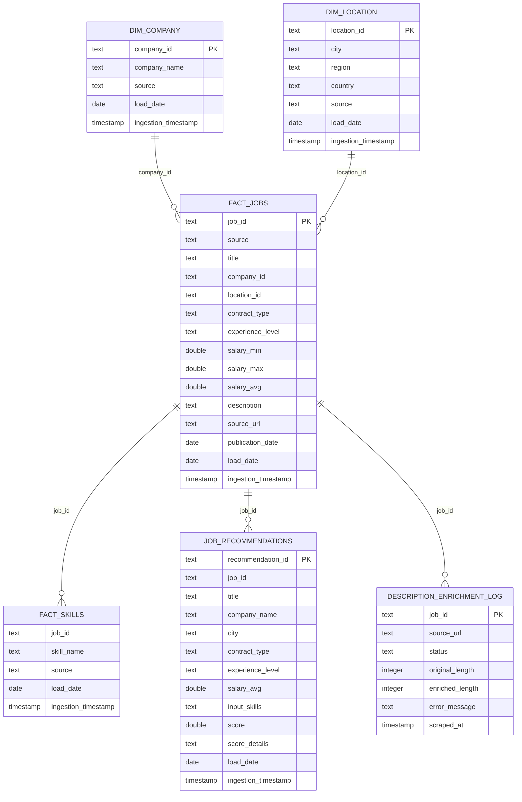

# Modele de donnees

## Schemas PostgreSQL

Le Data Warehouse utilise trois schemas :

- `analytics` pour les tables analytiques ;
- `serving` pour les vues ou tables optimisees pour l'API et le dashboard ;
- `ml` pour les vues salaire optionnelles.

## Schema relationnel

Le modele PostgreSQL est construit autour de `analytics.fact_jobs`, la table centrale des offres. Les dimensions `analytics.dim_company` et `analytics.dim_location` decrivent respectivement l'entreprise et la localisation. Les tables `analytics.fact_skills`, `analytics.job_recommendations` et `analytics.description_enrichment_log` sont rattachees aux offres par `job_id`.

Le dessin represente les liens logiques exploites dans les jointures. Le DDL actuel ne declare pas de contraintes `FOREIGN KEY` physiques. `description_enrichment_log.job_id` est sa cle primaire, et `fact_skills` est unique sur le couple `(job_id, skill_name)`.

Relations principales :

| Relation | Cardinalite | Role |
| --- | --- | --- |
| `dim_company.company_id` -> `fact_jobs.company_id` | 1 entreprise -> N offres | Eviter de repeter le nom d'entreprise dans chaque analyse. |
| `dim_location.location_id` -> `fact_jobs.location_id` | 1 localisation -> N offres | Normaliser les villes, regions et pays. |
| `fact_jobs.job_id` -> `fact_skills.job_id` | 1 offre -> N competences | Representer toutes les technologies detectees dans une offre. |
| `fact_jobs.job_id` -> `job_recommendations.job_id` | 1 offre -> 0 ou N recommandations | Garder les scores explicables lies aux offres recommandees. |
| `fact_jobs.job_id` -> `description_enrichment_log.job_id` | 1 offre -> 0 ou 1 ligne de suivi | Conserver le dernier statut d'enrichissement pour l'offre. |

Dans le MVP, ces relations sont exploitees par les jointures SQL, les index et les identifiants stables. En production, elles peuvent etre renforcees par des contraintes `FOREIGN KEY` physiques pour bloquer les incoherences a l'ecriture.

## Tables minimales

### analytics.fact_jobs

Table centrale des offres d'emploi.

Colonnes attendues :

- `job_id`
- `source`
- `title`
- `company_id`
- `location_id`
- `contract_type`
- `experience_level`
- `salary_min`
- `salary_max`
- `salary_avg`
- `description`
- `publication_date`
- `source_url`
- `load_date`
- `ingestion_timestamp`

### analytics.dim_company

Referentiel des entreprises.

Colonnes attendues :

- `company_id`
- `company_name`
- `source`
- `load_date`
- `ingestion_timestamp`

### analytics.dim_location

Referentiel des localisations.

Colonnes attendues :

- `location_id`
- `city`
- `region`
- `country`
- `source`
- `load_date`
- `ingestion_timestamp`

### analytics.fact_skills

Table des competences detectees dans les offres.

Colonnes attendues :

- `job_id`
- `skill_name`
- `source`
- `load_date`
- `ingestion_timestamp`

### analytics.job_recommendations

Table des recommandations explicables.

Colonnes attendues :

- `recommendation_id`
- `job_id`
- `input_skills`
- `score`
- `score_details`
- `load_date`
- `ingestion_timestamp`

### analytics.description_enrichment_log

Table d'audit de l'enrichissement HTML Adzuna.

Colonnes attendues :

- `job_id`
- `source_url`
- `status`
- `original_length`
- `enriched_length`
- `error_message`
- `scraped_at`

## Vues serving

### serving.jobs_public

Vue lisible des offres pour FastAPI et Streamlit. Elle masque les details techniques inutiles a l'utilisateur et joint les entreprises et localisations.

### serving.market_by_city

Vue d'analyse de la volumetrie d'offres par ville, triee pour l'affichage du marche de l'emploi.

### serving.skill_demand

Vue de demande par competence detectee.

## Vues salaire optionnelles

### ml.salary_prediction_features

Vue de features pour analyser les salaires disponibles et preparer une eventuelle prediction a partir des champs disponibles :

- titre ;
- entreprise ;
- ville ;
- region ;
- contrat ;
- experience ;
- source ;
- competences ;
- salaire cible quand disponible ;
- indicateur de qualite du salaire.

### ml.salary_training_dataset

Sous-ensemble exploitable pour entrainement, avec salaires presents et bornes metier coherentes.

### ml.salary_inference_dataset

Sous-ensemble contenant les offres sans salaire exploitable ou a predire.

### ml.salary_prediction_metadata

Vue de synthese pour piloter la qualite du dataset salaire : nombre de lignes, salaires minimum et maximum retenus, lignes exclues.
