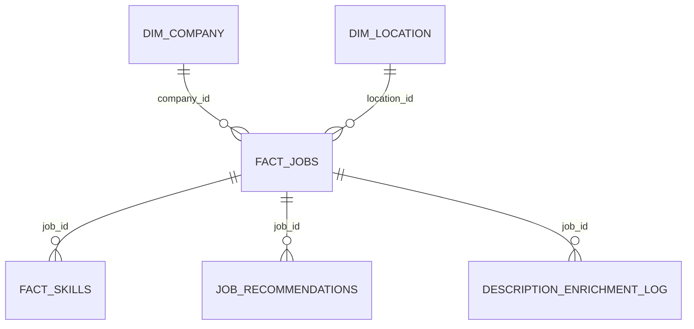

# PostgreSQL

## Objectif

PostgreSQL sert de Data Warehouse. Il ne remplace pas le Data Lake : les fichiers Bronze, Silver et Gold restent dans le stockage fichier, puis PostgreSQL expose les tables analytiques.

## Parametres locaux

Les informations de connexion ne sont pas ecrites en clair dans la documentation finale. Elles sont renseignees localement dans `.env`, fichier ignore par Git.

```text
POSTGRES_HOST=localhost
POSTGRES_PORT=5432
POSTGRES_DB=jobmarket
POSTGRES_USER=<utilisateur_postgresql_local>
POSTGRES_PASSWORD=<mot_de_passe_non_versionne>
```

## Installation Windows

Installer PostgreSQL 16 ou 17 avec l'installateur EDB.

Pendant l'installation :

```text
Port: 5432
Locale: Default
Stack Builder: decoche
```

Le mot de passe du compte `postgres` est choisi localement et ne doit pas etre documente dans Git.

## Creation de la base

Ouvrir SQL Shell `psql`, se connecter avec l'utilisateur `postgres`, puis executer :

```sql
CREATE USER <utilisateur_postgresql_local> WITH PASSWORD '<mot_de_passe_non_versionne>';
CREATE DATABASE jobmarket OWNER <utilisateur_postgresql_local>;
GRANT ALL PRIVILEGES ON DATABASE jobmarket TO <utilisateur_postgresql_local>;
```

Les memes valeurs doivent ensuite etre reportees uniquement dans le fichier `.env`.

## Chargement des donnees Gold

Quand PostgreSQL est pret :

```powershell
cd "<dossier_du_projet>"
.\.venv\Scripts\Activate.ps1
$env:PYTHONPATH="$PWD\src"
python scripts/run_local_pipeline.py --step load_postgres
```

Cette commande cree les schemas `analytics`, `serving` et `ml`, puis charge les tables `analytics` suivantes et les vues de service :

- `analytics.fact_jobs`
- `analytics.dim_company`
- `analytics.dim_location`
- `analytics.fact_skills`
- `analytics.job_recommendations`

## Relations entre les tables

PostgreSQL stocke un modele relationnel proche d'un schema en etoile. La table centrale est `analytics.fact_jobs`. Elle porte les offres et se relie aux dimensions entreprise et localisation.




Lecture du schema :

- une entreprise dans `dim_company` peut avoir plusieurs offres dans `fact_jobs` ;
- une ville/localisation dans `dim_location` peut regrouper plusieurs offres ;
- une offre peut avoir plusieurs competences detectees dans `fact_skills` ;
- une offre peut etre rattachee a une recommandation avec un score explicable ;
- une offre peut avoir une ligne de suivi du dernier enrichissement HTML Adzuna dans `description_enrichment_log`.

Ces identifiants servent aux jointures des vues `serving` et `ml`, puis aux traitements FastAPI et Streamlit. Dans le DDL actuel, ce sont des relations logiques : les contraintes `FOREIGN KEY` physiques ne sont pas declarees.

## Verification SQL

```sql
SELECT COUNT(*) FROM analytics.fact_jobs;
SELECT COUNT(*) FROM analytics.dim_company;
SELECT skill_name, COUNT(*) FROM analytics.fact_skills GROUP BY skill_name ORDER BY COUNT(*) DESC;
SELECT title, company_name, score FROM analytics.job_recommendations ORDER BY score DESC;
```
