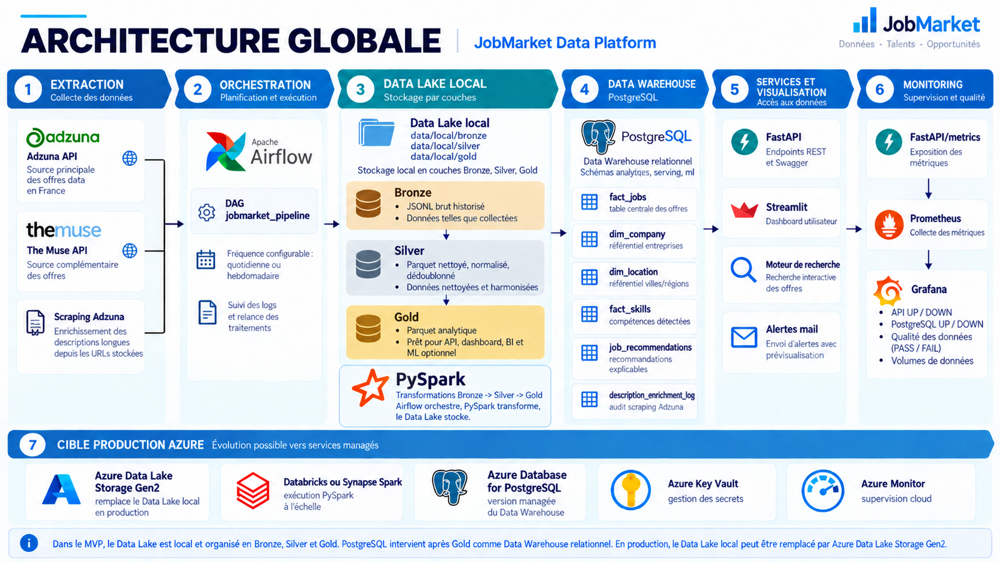
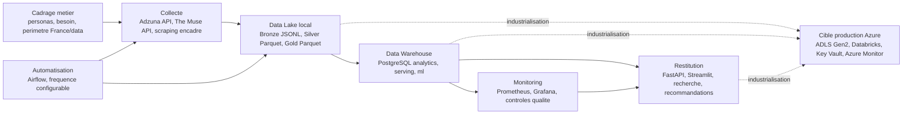

# Roadmap projet

## Objectif

Cette roadmap presente les travaux par mois, depuis le cadrage jusqu'a la livraison finale. Elle donne une vision projet plus realiste qu'une liste de taches par jour.

## Roadmap visuelle

Le visuel ci-dessous resume le cheminement technique du projet, depuis les sources jusqu'au monitoring et a la trajectoire Azure.

## Planning mensuel

| Mois | Travaux principaux | Livrables / preuves |
| --- | --- | --- |
| Decembre 2024 | Redaction du cahier des charges, cadrage du besoin, identification des utilisateurs cibles. | Cahier des charges initial, objectifs metier, personas. |
| Janvier 2025 | Consolidation du perimetre, veille sur les sources d'offres d'emploi, choix du sujet data en France. | Perimetre fonctionnel, contraintes, risques initiaux. |
| Fevrier 2025 | Conception technique et fonctionnelle, choix de l'architecture cible Azure et des composants open-source. | Architecture cible, choix PySpark, Airflow, PostgreSQL, FastAPI, Streamlit. |
| Mars 2025 | Definition du modele de donnees, couches Bronze/Silver/Gold, structure du depot et premieres specifications API. | Modele de donnees, structure Git, documentation d'architecture. |
| Avril 2025 | Mise en place de l'environnement local, dependances Python, conventions projet et premiers tests. | Environnement reproductible, README, tests de structure. |
| Mai 2025 | Prototypage des connecteurs de collecte, preparation du plan d'extraction et des filtres France/data. | Connecteurs prototypes, configuration `extraction_plan.json`. |
| Juin 2025 | Tests des sources externes, analyse des limites API, cadrage du scraping optionnel. | Analyse Adzuna, The Muse, scraping optionnel et contraintes. |
| Juillet 2025 | Preparation de l'ingestion industrialisable, gestion des quotas, normalisation des champs communs. | Schema commun d'offres, strategie de pagination. |
| Aout 2025 | Collecte Adzuna sur les metiers data en France et stockage Bronze. | Donnees Bronze historisees. |
| Septembre 2025 | Integration du connecteur The Muse et filtrage du perimetre France/data. | Ingestion multi-source et filtres de focus. |
| Octobre 2025 | Mise en place du module web scraping optionnel et evaluation des sources HTML. | Scraping optionnel, decision de non-blocage. |
| Novembre 2025 | Transformations Bronze vers Silver avec PySpark : nettoyage, typage, dedoublonnage. | Donnees Silver au format Parquet. |
| Decembre 2025 | Transformations Silver vers Gold avec PySpark : faits, dimensions, statistiques. | Donnees Gold analytiques. |
| Janvier 2026 | Extraction des competences, recommandations explicables, controles qualite. | `fact_skills`, `job_recommendations`, rapport qualite. |
| Fevrier 2026 | Chargement PostgreSQL et creation des schemas `analytics`, `serving` et `ml`. | Data Warehouse PostgreSQL, vues serving et vues salaire optionnelles. |
| Mars 2026 | Developpement FastAPI : endpoints metier, recherche, recommandations, monitoring et alertes. | API REST documentee avec Swagger. |
| Avril 2026 | Developpement Streamlit : pages marche, salaires, competences, entreprises et accueil. | Dashboard utilisateur. |
| Mai 2026 | Ajout du moteur de recherche interactif, page salaire avancee, recommandations et alertes mail. | Recherche multicritere, vues salaire optionnelles, alertes en preview. |
| Juin 2026 | Tests et validation : API, pipeline, PostgreSQL, monitoring, securite des secrets. | Suite de tests automatisee, scan secrets. |
| Juillet 2026 | Amelioration UX du dashboard, nettoyage des donnees, suppression des samples et URLs d'exemple. | Dashboard final, qualite data PASS. |
| Aout 2026 | Deploiement local et Docker Compose, Airflow, Prometheus, Grafana, documentation de reprise. | Services conteneurises, monitoring, scripts de relance. |
| Septembre 2026 | Finalisation du rapport, cahier des charges, documentation et verification finale. | Livrables projet, rapport final consolide, demonstration. |

## Jalons de validation

| Jalon | Critere |
| --- | --- |
| Cadrage valide | Sujet, personas, besoins et limites documentes. |
| Pipeline executable | Extraction, transformation PySpark et chargement PostgreSQL rejouables. |
| Donnees propres | Donnees reelles, sans sources `sample`, sans URLs `example.com`. |
| Restitution fonctionnelle | API Swagger et dashboard Streamlit disponibles. |
| Automatisation | DAG Airflow planifie en quotidien ou hebdomadaire. |
| Monitoring | Prometheus collecte `/metrics` et Grafana affiche les indicateurs. |
| Securite | Secrets dans `.env`, scan anti-fuite OK, pas de mot de passe en clair dans Git. |
| Livraison finale | Rapport final, cahier des charges et demo prets. |

## Sprint final

Priorites de finalisation :

1. Stabiliser la demo locale avec PostgreSQL, FastAPI, Streamlit, Prometheus et Grafana.
2. Verifier que les tests passent et que le scan secrets est OK.
3. Mettre a jour les livrables jury : rapport final, cahier des charges, README de transmission.
4. Remplacer le placeholder du lien Git par l'URL reelle du depot.
5. Ajouter ou finaliser le support de presentation local.
